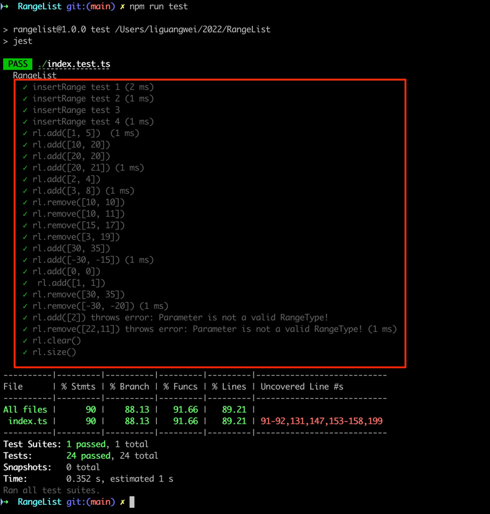

# Class RangeList
A pair of integers define a range
- for example: [1, 5). This range includes integers: 1, 2, 3, and 4.
- for example: [1, 3) [7, 9). This range includes integers: 1, 2,7 and 8.


## Getting Started

```bash
npm run install --registry=https://registry.npmmirror.com
# unit testing
npm run test
# compile to es5
npm run build

```




